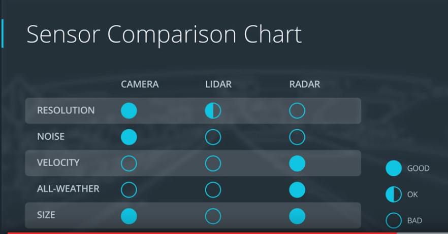

# Introduction and Sensors
## Radar Strengths and Weaknesses
Strengths:
1. Because radar waves bounce off hard surfaces, they can provide measurements to
objects without direct line of flight.
2. Radar can see underneath other vehicles, and spot buildings and objects that
would be obscured otherwise.
3. Of all the sensors on the car, radar is the least affected by rain or fog and
can have a wide field of view, about 150 degrees, or a long range, 200 plus meters.

Weaknesses:
1. Compared to lidars and cameras, radars have a low resolution.
Especially in the vertical direction, the resolution is very limited.
The lower resolution also means that reflections from static objects can cause
problems. For example, manhole covers or a soda can lying on the street can have high radar reflectivity even though they are relatively small. It's called radar
clutter and it's why current automotive radars usually disregard static objects.

## Lidar Strengths and Weaknesses

lidar uses an infrared laser beam to determine the distance between the sensor and a nearby object.

Strengths:
1. Lidar has a much higher spatial resolution than radar because of the more focused laser beam, the larger number of scan layers in the vertical direction, and the high density of lidar points per layer.

Weaknesses:
1. The current generations of lidar can not measure the velocity of objects directly
, and have to rely on the differing position between two or more scans.
2. lidars are also more affected by weather conditions and by dirt on the sensor, which requires keeping them clean.
3. They are also much bulkier than other sensors and therefore more difficult to integrate unless one just wants to mount a big scanner of the roof of the vehicle.

Footnote on Lidar
There are other possibilities to scan the laser beams. Instead of rotating the lasers or having a rotating mirror, we can scan the lidar with a vibrating micromirror. Those lidars are in development but none are commercially available now (as of March 2017).

Instead of mechanically moving the laser beam, a similar principle to phased array radar can be employed. Dividing a single laser beam into multiple waveguides, the phase relationship between the waveguides can be altered and thereby the direction of the laser beam shifted. A company named Quanergy is working on systems like that. The advantage is that the form factor can be much smaller and that there are no moving parts.

Another possibility is to use the laser as a gigantic flash like with a camera and then measuring the arrival times for all the objects with one big imaging photodiode array. This is in effect a 3D camera. The components are currently very expensive and currently this is used more in space and in terrain mapping applications.

